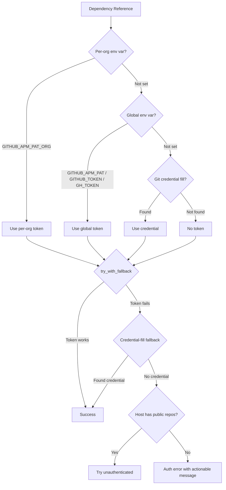

APM works without tokens for public packages on github.com. Authentication is needed for private repositories, enterprise hosts (`*.ghe.com`, GHES), and Azure DevOps.

## How APM resolves authentication

APM resolves tokens per `(host, org)` pair. For each dependency, it walks a resolution chain until it finds a token:

1. **Per-org env var** — `GITHUB_APM_PAT_{ORG}` (GitHub-like hosts — not ADO)
2. **Global env vars** — `GITHUB_APM_PAT` → `GITHUB_TOKEN` → `GH_TOKEN` (any host)
3. **Git credential helper** — `git credential fill` (any host except ADO)

If the global token doesn't work for the target host, APM automatically retries with git credential helpers. If nothing matches, APM attempts unauthenticated access (works for public repos on github.com).

Results are cached per-process — the same `(host, org)` pair is resolved once.

All token-bearing requests use HTTPS. Tokens are never sent over unencrypted connections.

## Token lookup

| Priority | Variable | Scope | Notes |
|----------|----------|-------|-------|
| 1 | `GITHUB_APM_PAT_{ORG}` | Per-org, GitHub-like hosts | Org name uppercased, hyphens → underscores |
| 2 | `GITHUB_APM_PAT` | Any host | Falls back to git credential helpers if rejected |
| 3 | `GITHUB_TOKEN` | Any host | Shared with GitHub Actions |
| 4 | `GH_TOKEN` | Any host | Set by `gh auth login` |
| 5 | `git credential fill` | Per-host | System credential manager, `gh auth`, OS keychain |

For Azure DevOps, the only token source is `ADO_APM_PAT`.

For JFrog Artifactory, use `ARTIFACTORY_APM_TOKEN`. See the [Repository Proxy guide](../../enterprise/repository-proxy/) for setup instructions, transparent proxy configuration, and air-gapped mode.

For runtime features (`GITHUB_COPILOT_PAT`), see [Agent Workflows](../../guides/agent-workflows/).

### Configuration variables

| Variable | Purpose |
|----------|---------|
| `APM_GIT_CREDENTIAL_TIMEOUT` | Timeout in seconds for `git credential fill` (default: 60, max: 180) |
| `GITHUB_HOST` | Default host for bare package names (e.g., GHES hostname) |

## Multi-org setup

When your manifest pulls from multiple GitHub organizations, use per-org env vars:

```bash
export GITHUB_APM_PAT_CONTOSO=ghp_token_for_contoso
export GITHUB_APM_PAT_FABRIKAM=ghp_token_for_fabrikam
```

The org name comes from the dependency reference — `contoso/my-package` checks `GITHUB_APM_PAT_CONTOSO`. Naming rules:

- Uppercase the org name
- Replace hyphens with underscores
- `contoso-microsoft` → `GITHUB_APM_PAT_CONTOSO_MICROSOFT`

Per-org tokens take priority over global tokens. Use this when different orgs require different PATs (e.g., separate SSO authorizations).

## Fine-grained PAT setup

Fine-grained PATs (`github_pat_`) are scoped to a **single resource owner** — either a user account or an organization. A user-scoped fine-grained PAT **cannot** access repos owned by an organization, even if you are a member of that org.

To access org packages, create the PAT with the **org** as the resource owner at [github.com/settings/personal-access-tokens/new](https://github.com/settings/personal-access-tokens/new).

Required permissions:

| Permission | Level | Purpose |
|------------|-------|---------|
| **Metadata** | Read | Validation and discovery |
| **Contents** | Read | Downloading package files |

Set **Repository access** to "All repositories" or select the specific repos your manifest references.

**Alternatives that skip scoping entirely:**

- `gh auth login` — produces an OAuth token that inherits your full org membership. Easiest zero-config path.
- Classic PATs (`ghp_`) — inherit the user's membership across all orgs. GitHub is deprecating these in favor of fine-grained PATs.

## Enterprise Managed Users (EMU)

EMU orgs can live on **github.com** (e.g., `contoso-microsoft`) or on **GHE Cloud Data Residency** (`*.ghe.com`). EMU tokens are standard PATs (`ghp_` classic or `github_pat_` fine-grained) — there is no special prefix. They are scoped to the enterprise and cannot access public repos on github.com.

Fine-grained PATs for EMU orgs **must** use the EMU org as the resource owner — a user-scoped fine-grained PAT will not work. See [Fine-grained PAT setup](#fine-grained-pat-setup).

If your manifest mixes enterprise and public packages, use separate tokens:

```bash
export GITHUB_APM_PAT_CONTOSO_MICROSOFT=github_pat_enterprise_token  # EMU org
```

Public repos on github.com work without authentication. Set `GITHUB_APM_PAT` only if you need to access private repos or avoid rate limits.

### GHE Cloud Data Residency (`*.ghe.com`)

`*.ghe.com` hosts are always auth-required — there are no public repos. APM skips the unauthenticated attempt entirely for these hosts:

```bash
export GITHUB_APM_PAT_MYENTERPRISE=ghp_enterprise_token
apm install myenterprise.ghe.com/platform/standards
```

## GitHub Enterprise Server (GHES)

Set `GITHUB_HOST` to your GHES instance. Bare package names resolve against this host:

```bash
export GITHUB_HOST=github.company.com
export GITHUB_APM_PAT_MYORG=ghp_ghes_token
apm install myorg/internal-package  # → github.company.com/myorg/internal-package
```

Use full hostnames for packages on other hosts:

```yaml
dependencies:
  apm:
    - team/internal-package                   # → GITHUB_HOST
    - github.com/public/open-source-package   # → github.com
```

Setting `GITHUB_HOST` makes bare package names (without explicit host) resolve against your GHES instance. Alternatively, skip env vars and configure `git credential fill` for your GHES host.

## Azure DevOps

```bash
export ADO_APM_PAT=your_ado_pat
apm install dev.azure.com/myorg/myproject/myrepo
```

ADO is always auth-required. Uses 3-segment paths (`org/project/repo`). No `ADO_HOST` equivalent — always use FQDN syntax:

```bash
apm install dev.azure.com/myorg/myproject/myrepo#main
apm install mycompany.visualstudio.com/org/project/repo  # legacy URL
```

Create the PAT at `https://dev.azure.com/{org}/_usersSettings/tokens` with **Code (Read)** permission.

## Package source behavior

| Package source | Host | Auth behavior | Fallback |
|---|---|---|---|
| `org/repo` (bare) | `default_host()` | Global env vars → credential fill | Unauth for public repos |
| `github.com/org/repo` | github.com | Global env vars → credential fill | Unauth for public repos |
| `contoso.ghe.com/org/repo` | *.ghe.com | Global env vars → credential fill | Auth-only (no public repos) |
| GHES via `GITHUB_HOST` | ghes.company.com | Global env vars → credential fill | Unauth for public repos |
| `dev.azure.com/org/proj/repo` | ADO | `ADO_APM_PAT` only | Auth-only |

## Troubleshooting

### Rate limits on github.com

APM tries unauthenticated access first for public repos to conserve rate limits during validation (e.g., checking if a repo exists). For downloads, authenticated requests are preferred — with unauthenticated fallback for public repos on github.com. If you hit rate limits, set any token:

```bash
export GITHUB_TOKEN=ghp_any_valid_token
```

### SSO-protected organizations

Authorize your PAT for SSO at [github.com/settings/tokens](https://github.com/settings/tokens) — click **Configure SSO** next to the token.

### EMU token can't access public repos

EMU PATs use standard prefixes (`ghp_`, `github_pat_`) — there is no EMU-specific prefix. They are enterprise-scoped and cannot access public github.com repos. Use a standard PAT for public repos alongside your EMU PAT — see [Enterprise Managed Users (EMU)](#enterprise-managed-users-emu) above.

### Fine-grained PAT can't access org repos

Fine-grained PATs are scoped to one resource owner. If you created the PAT under your **user account**, it cannot access repos owned by an organization — even if you are an org member. Recreate the PAT with the **org** as the resource owner. Classic PATs (`ghp_`) and `gh auth login` OAuth tokens do not have this limitation. See [Fine-grained PAT setup](#fine-grained-pat-setup).

### Diagnosing auth failures

Run with `--verbose` to see the full resolution chain:

```bash
apm install --verbose your-org/package
```

The output shows which env var matched (or `none`), the detected token type (`fine-grained`, `classic`, `oauth`, `github-app`), and the host classification (`github`, `ghe_cloud`, `ghes`, `ado`, `generic`).

The full resolution and fallback flow:



### Git credential helper not found

APM calls `git credential fill` as a fallback (60s timeout). If your credential helper needs more time (e.g., Windows account picker), set `APM_GIT_CREDENTIAL_TIMEOUT` (seconds, max 180):

```bash
export APM_GIT_CREDENTIAL_TIMEOUT=120
```

Ensure a credential helper is configured:

```bash
git config credential.helper              # check current helper
git config --global credential.helper osxkeychain  # macOS
gh auth login                              # GitHub CLI
```
